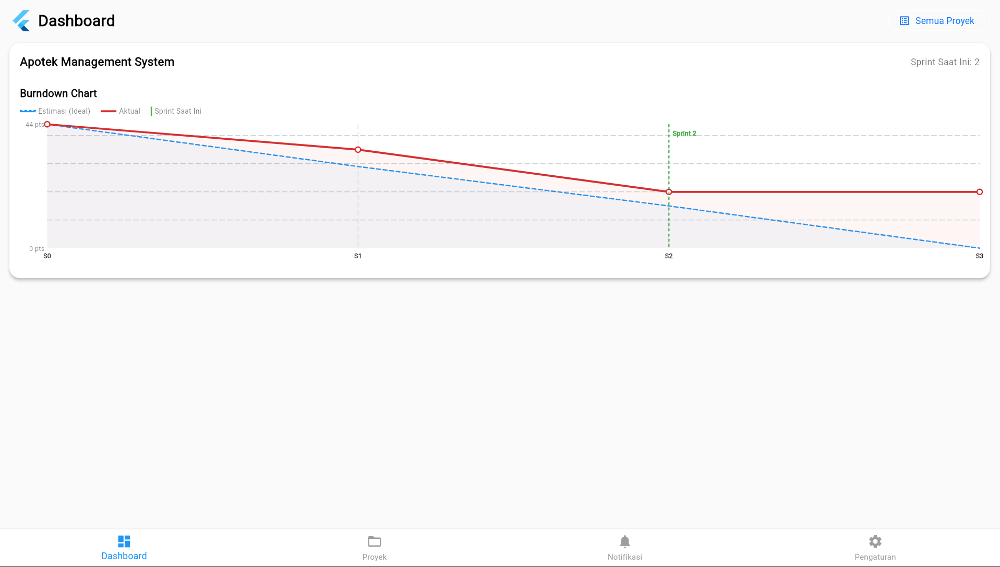
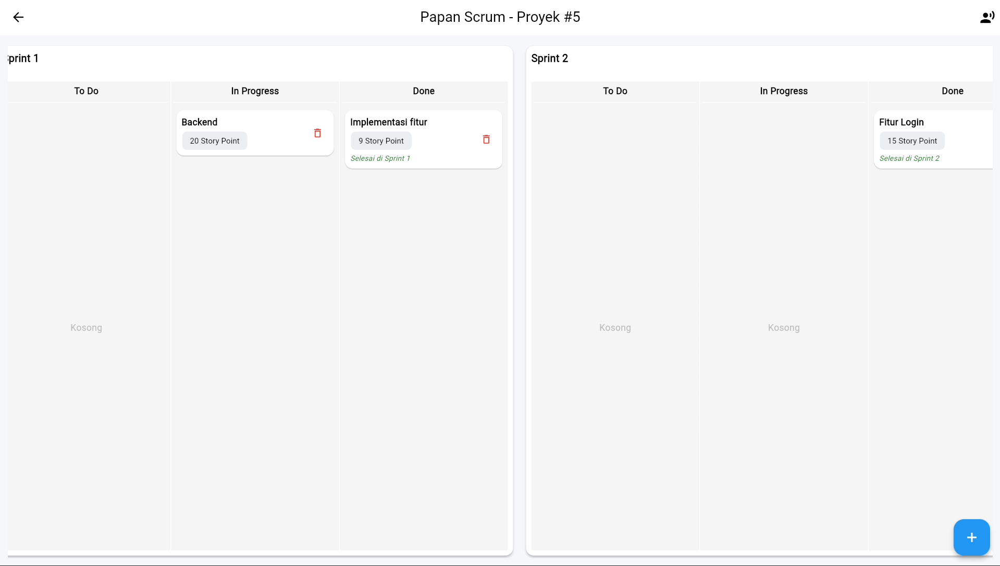
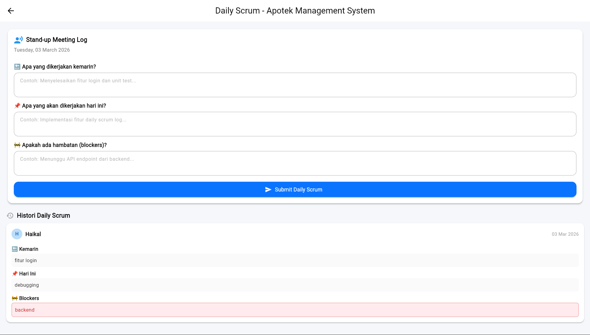

# Kelompok 3 - PPL PRAK I6

### 👥 Anggota Tim
*   **Haikal Riyadh Romadhon** (502510310005)
*   **Tantri Pradipta Kusumawardani** (502510310007)
*   **Deviani Trinita** (502510310008)
*   **Jasmine Mumtaz** (502510310010)

---

# 📱 Scrum Project Manager

> Aplikasi manajemen proyek berbasis **Agile/Scrum** yang dibangun dengan **Flutter** (frontend) dan **PHP + MySQL** (backend REST API). Mendukung fitur lengkap: Sprint Planning, Scrum Board drag-and-drop, Burndown Chart, Daily Scrum Log, Role-Based Access Control, dan notifikasi cerdas.

---

## 📖 Table of Contents

- [Architecture Overview](#-architecture-overview)
- [Tech Stack](#-tech-stack)
- [API Flow Diagram](#-api-flow-diagram)
- [Database Schema](#-database-schema)
- [Use Cases](#-use-cases)
- [Features](#-features)
- [Screenshots / Preview](#-screenshots--preview)
- [Getting Started](#-getting-started)
- [Testing](#-testing)
- [Deployment](#-deployment)
- [Project Structure](#-project-structure)

---

## 🏛️ Architecture Overview

Aplikasi menggunakan **Client-Server Architecture** dengan pola **Provider State Management** di sisi Flutter:

```
┌──────────────────────────────────────────────────────────┐
│                    FLUTTER APP (Client)                   │
│                                                          │
│  ┌──────────┐   ┌──────────────┐   ┌──────────────────┐ │
│  │  Screens  │◄──│   Provider   │──►│   HTTP Client    │ │
│  │  (UI)     │   │ (State Mgmt) │   │   (http pkg)     │ │
│  └──────────┘   └──────────────┘   └────────┬─────────┘ │
│                                              │           │
└──────────────────────────────────────────────┼───────────┘
                                               │ REST API
                                               │ (JSON over HTTP)
┌──────────────────────────────────────────────┼───────────┐
│                  PHP BACKEND (Server)         │           │
│                                              ▼           │
│  ┌──────────────┐   ┌──────────────┐   ┌──────────────┐ │
│  │  API Helpers  │──►│  Endpoints   │──►│    MySQL     │ │
│  │  (CORS,Auth)  │   │  (CRUD ops)  │   │  Database    │ │
│  └──────────────┘   └──────────────┘   └──────────────┘ │
│                                                          │
└──────────────────────────────────────────────────────────┘
```

### Arsitektur Layer

| Layer | Teknologi | Tanggung Jawab |
|-------|-----------|----------------|
| **Presentation** | Flutter Widgets + Screens | UI rendering, user interaction, drag & drop |
| **State Management** | Provider (ChangeNotifier) | Business logic, state caching, optimistic updates |
| **Network** | Dart `http` package | REST API communication, JSON serialization |
| **API** | PHP (vanilla) | Request validation, business rules, DB operations |
| **Database** | MySQL (InnoDB) | Data persistence, referential integrity, transactions |

### Design Patterns

- **Provider Pattern** — Centralized state management via `SprintProvider`
- **Optimistic Update** — UI updates instantly, rolls back on server error
- **Repository Pattern** — API endpoints abstracted from UI logic
- **Smart Notifications** — Backend auto-generates context-aware reminders

---

## 🛠️ Tech Stack

| Component | Technology | Version |
|-----------|-----------|---------|
| Frontend | Flutter (Dart) | SDK ≥3.0.0 |
| State Management | Provider | ^6.1.2 |
| Charts | fl_chart | ^0.69.0 |
| HTTP Client | http | ^1.2.2 |
| Date Formatting | intl | latest |
| Backend | PHP | ≥8.0 |
| Database | MySQL / MariaDB | ≥5.7 |
| Web Server | Apache (XAMPP/Laragon) | - |

---

## 🔄 API Flow Diagram

### Authentication Flow

```
┌─────────┐         ┌──────────┐         ┌─────────┐
│  Flutter │         │   PHP    │         │  MySQL  │
│   App    │         │  Backend │         │   DB    │
└────┬────┘         └────┬─────┘         └────┬────┘
     │                    │                    │
     │  POST /login.php   │                    │
     │  {username, pass}  │                    │
     │───────────────────►│                    │
     │                    │  SELECT user       │
     │                    │───────────────────►│
     │                    │   user row         │
     │                    │◄───────────────────│
     │                    │                    │
     │                    │ password_verify()   │
     │                    │                    │
     │  {status, data:    │                    │
     │   {id, username,   │                    │
     │    full_name, role}}│                    │
     │◄───────────────────│                    │
     │                    │                    │
     │ setUserData()      │                    │
     │ Navigate to Home   │                    │
```

### Scrum Board Task Flow (Optimistic Update)

```
┌─────────┐         ┌──────────────┐         ┌─────────┐
│  Flutter │         │  PHP Backend │         │  MySQL  │
└────┬────┘         └──────┬───────┘         └────┬────┘
     │                      │                      │
     │ Drag task to Sprint  │                      │
     │ (UI updates instantly)                      │
     │                      │                      │
     │ POST /update_task    │                      │
     │ _status.php          │                      │
     │ {task_id, status,    │                      │
     │  assigned_sprint}    │                      │
     │─────────────────────►│                      │
     │                      │  UPDATE tasks SET..  │
     │                      │─────────────────────►│
     │                      │       OK             │
     │                      │◄─────────────────────│
     │                      │                      │
     │                      │  INSERT notification │
     │                      │─────────────────────►│
     │  {status: success}   │                      │
     │◄─────────────────────│                      │
     │                      │                      │
     │ ✓ Confirmed          │                      │
     │  (or rollback)       │                      │
```

### Daily Scrum Log Flow

```
┌─────────┐         ┌──────────────┐         ┌─────────┐
│  Flutter │         │  PHP Backend │         │  MySQL  │
└────┬────┘         └──────┬───────┘         └────┬────┘
     │                      │                      │
     │ POST /add_daily      │                      │
     │ _scrum.php           │                      │
     │ {project_id,         │                      │
     │  yesterday, today,   │                      │
     │  blockers}           │                      │
     │─────────────────────►│                      │
     │                      │  INSERT daily_scrums │
     │                      │─────────────────────►│
     │  {status: success}   │                      │
     │◄─────────────────────│                      │
     │                      │                      │
     │ GET /get_daily       │                      │
     │ _scrums.php?         │                      │
     │ project_id=X         │                      │
     │─────────────────────►│                      │
     │                      │  SELECT daily_scrums │
     │                      │─────────────────────►│
     │  {data: [...logs]}   │                      │
     │◄─────────────────────│                      │
```

---

## 🗄️ Database Schema (ERD)

```
┌──────────────┐       ┌──────────────────┐
│    users     │       │    projects      │
├──────────────┤       ├──────────────────┤
│ id (PK)      │◄──┐   │ id (PK)          │
│ username     │   │   │ user_id (FK)─────┼──►users.id
│ password     │   │   │ name             │
│ full_name    │   │   │ sprint           │
│ role         │   │   │ current_sprint   │
│ created_at   │   │   │ progress         │
└──────────────┘   │   │ status           │
                   │   │ created_at       │
                   │   └──────┬───────────┘
                   │          │
                   │   ┌──────┴───────────┐
                   │   │     tasks        │
                   │   ├──────────────────┤
                   │   │ id (PK)          │
                   │   │ project_id (FK)──┼──►projects.id
                   │   │ title            │
                   │   │ story_points     │
                   │   │ status (ENUM)    │
                   │   │ assigned_sprint  │
                   │   │ completion_sprint│
                   │   │ created_at       │
                   │   └──────────────────┘
                   │
                   │   ┌──────────────────┐
                   │   │  notifications   │
                   │   ├──────────────────┤
                   │   │ id (PK)          │
                   ├───┤ user_id (FK)─────┼──►users.id
                   │   │ title            │
                   │   │ message          │
                   │   │ type             │
                   │   │ is_read          │
                   │   │ created_at       │
                   │   └──────────────────┘
                   │
                   │   ┌──────────────────┐
                   │   │  daily_scrums    │
                   │   ├──────────────────┤
                   │   │ id (PK)          │
                   └───┤ user_id (FK)─────┼──►users.id
                       │ project_id (FK)──┼──►projects.id
                       │ yesterday (TEXT) │
                       │ today (TEXT)     │
                       │ blockers (TEXT)  │
                       │ scrum_date (DATE)│
                       │ created_at       │
                       └──────────────────┘
```

---

## 📋 Use Cases

### UC-01: Register & Login

| Field | Detail |
|-------|--------|
| **Actor** | User (Developer / Scrum Master) |
| **Precondition** | Aplikasi terinstall, server backend aktif |
| **Main Flow** | 1. User membuka app → Halaman Login<br>2. User tap "Register" → Isi form (nama, username, password)<br>3. Sistem validasi & simpan ke DB<br>4. User login dengan credential<br>5. Sistem verifikasi password hash → Navigasi ke Dashboard |
| **Postcondition** | User terautentikasi, data tersimpan di Provider |

### UC-02: Membuat Proyek Baru

| Field | Detail |
|-------|--------|
| **Actor** | Scrum Master |
| **Precondition** | User sudah login |
| **Main Flow** | 1. User buka halaman Projects<br>2. Isi nama proyek & jumlah sprint<br>3. Tekan "Create Project"<br>4. Sistem simpan ke DB & refresh daftar proyek |
| **Postcondition** | Proyek baru muncul di daftar |

### UC-03: Mengelola Scrum Board (Drag & Drop)

| Field | Detail |
|-------|--------|
| **Actor** | Developer / Scrum Master |
| **Precondition** | Proyek sudah dibuat, task sudah ada di backlog |
| **Main Flow** | 1. User buka proyek → Scrum Board<br>2. Drag task dari Backlog ke Sprint (To Do)<br>3. Drag task To Do → In Progress → Done<br>4. UI update optimistic, backend sync & buat notifikasi |
| **Business Rules** | - Task masuk sprint via "To Do"<br>- "In Progress" & "Done" hanya dari sprint sama<br>- Completion sprint tercatat saat status = Done |
| **Postcondition** | Board terupdate, burndown chart berubah |

### UC-04: Melihat Burndown Chart

| Field | Detail |
|-------|--------|
| **Actor** | Scrum Master / Developer |
| **Precondition** | Proyek memiliki task dengan story points |
| **Main Flow** | 1. User buka Dashboard<br>2. Sistem hitung ideal vs actual burndown<br>3. Chart tampilkan garis estimated (dashed) & actual (solid) |
| **Postcondition** | Visualisasi real-time progress proyek |

### UC-05: Daily Scrum Log

| Field | Detail |
|-------|--------|
| **Actor** | Developer / Scrum Master |
| **Precondition** | User sudah login, proyek ada |
| **Main Flow** | 1. User buka Daily Scrum dari proyek<br>2. Isi 3 pertanyaan: Yesterday / Today / Blockers<br>3. Submit → tersimpan di database<br>4. Histori daily scrum bisa dilihat per proyek |
| **Postcondition** | Log daily scrum tercatat untuk audit trail |

### UC-06: Notifikasi Cerdas

| Field | Detail |
|-------|--------|
| **Actor** | User |
| **Precondition** | User sudah login |
| **Main Flow** | 1. Sistem auto-generate smart reminders<br>2. Bottleneck alert (>3 task in progress)<br>3. Deadline alert (last sprint, <80% progress)<br>4. Empty project reminder |
| **Postcondition** | User aware terhadap status proyek |

### UC-07: Role-Based Access (Scrum Master vs Developer)

| Field | Detail |
|-------|--------|
| **Actor** | Scrum Master / Developer |
| **Main Flow** | 1. Login mengembalikan role user<br>2. Scrum Master: create project, assign task<br>3. Developer: update task, submit daily scrum<br>4. UI menyesuaikan berdasarkan role |

---

## ✨ Features

### Core Features
- ✅ **User Authentication** — Register & Login dengan password hashing (bcrypt)
- ✅ **Project Management** — CRUD proyek dengan jumlah sprint kustom
- ✅ **Scrum Board** — Drag & drop task (Backlog → To Do → In Progress → Done)
- ✅ **Sprint Planning** — Assign task ke sprint tertentu
- ✅ **Burndown Chart** — Visualisasi ideal vs actual progress per proyek
- ✅ **Smart Notifications** — Auto-generated reminders (bottleneck, deadline, empty project)

### Advanced Features
- ✅ **Role-Based Access Control** — Scrum Master & Developer permissions
- ✅ **Daily Scrum Log** — 3-question standup log (Yesterday/Today/Blockers)
- ✅ **Optimistic UI Updates** — Instant feedback dengan rollback on error
- ✅ **Notification Polling** — Auto-refresh notifikasi setiap 30 detik
- ✅ **Responsive Design** — Support mobile dan web

---

## 📸 Screenshots / Preview

> Tambahkan screenshot di folder `docs/screenshots/` dan update path di bawah.

| Screen | Preview |
|--------|---------|
| **Login Page** |  |
| **Dashboard + Burndown** |  |
| **Scrum Board** |  |
| **Daily Scrum Log** |  |
| **Notifications** |  |

---

## 🚀 Getting Started

### Prerequisites

- Flutter SDK ≥ 3.0.0
- PHP ≥ 8.0
- MySQL / MariaDB ≥ 5.7
- XAMPP / Laragon / WAMP

### 1. Clone Repository

```bash
git clone https://github.com/HaikalRiyadh/Manajemen-kolaborasi-Scrum
cd project
```

### 2. Setup Database

```bash
mysql -u root -e "CREATE DATABASE IF NOT EXISTS lib_scrum_app;"
mysql -u root lib_scrum_app < project_ppl/projects.sql
```

### 3. Setup Backend

- **Laragon:** Pindahkan folder `project_ppl` ke `C:\laragon\www\`
- **XAMPP:** Pindahkan folder `project_ppl` ke `C:\xampp\htdocs\`

### 4. Setup Flutter

```bash
flutter pub get
flutter run
```

### Konfigurasi IP

- **Web:** Otomatis `http://localhost/project_ppl`
- **Emulator:** Otomatis `http://10.0.2.2/project_ppl`
- **HP Fisik:** Edit IP di `lib/services/sprint_provider.dart`

---

## 🧪 Testing

### Backend Unit Tests (PHP)

```bash
cd project_ppl/tests
php test_runner.php
```

### Flutter Widget Tests

```bash
flutter test
```

Tests cover: model validation, provider logic, widget rendering, navigation flow, form validation.

---

## ☁️ Deployment

### Docker

```bash
docker-compose up -d
# App: http://localhost:8080
# API: http://localhost:8081/project_ppl
# phpMyAdmin: http://localhost:8082
```

### Railway

1. Push ke GitHub
2. Connect di [Railway](https://railway.app)
3. Auto-detects `Dockerfile`
4. Set env variables → Deploy

---

## 📁 Project Structure

```
project/
├── lib/                          # Flutter source code
│   ├── main.dart                 # App entry point
│   ├── theme.dart                # Theme configuration
│   ├── models/models.dart        # Data models
│   ├── screens/                  # All screens (login, dashboard, scrum, etc.)
│   ├── services/sprint_provider.dart  # Central state management
│   └── widgets/                  # Reusable UI components
├── project_ppl/                  # PHP Backend API
│   ├── api_helpers.php           # Config (CORS, DB, error handling)
│   ├── login.php / register.php  # Auth endpoints
│   ├── add_project.php           # Project CRUD
│   ├── add_task.php              # Task CRUD
│   ├── update_task_status.php    # Task status updates
│   ├── get_all_data.php          # Fetch all user data
│   ├── get_notifications.php     # Smart notifications
│   ├── add_daily_scrum.php       # Daily scrum log
│   ├── get_daily_scrums.php      # Fetch daily scrums
│   ├── projects.sql              # Database schema
│   └── tests/                    # Backend unit tests
├── test/                         # Flutter tests
├── docker-compose.yml            # Docker deployment
├── Dockerfile                    # Backend container
└── pubspec.yaml                  # Flutter dependencies
```

---

## 📄 License

Developed for PPL (Pengembangan Perangkat Lunak) coursework.

> 💡 **Demo**: [Coming Soon — Deploy to Railway/Cloud]
